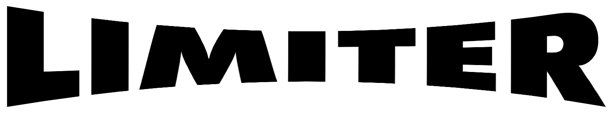

<p align="center">

<br>
<a href="https://godoc.org/github.com/tidwall/limiter"></a>
</p>

Limiter is a Golang library for limiting work coming from any number of goroutines.
This is useful when you need limit the maximum number of concurrent calls to a specific operation.

## Install

``` sh
go get github.com/tidwall/limiter
```


## Example

``` go
package main

import (
	"io/ioutil"
	"net/http"

	"github.com/tidwall/limiter"
)

func main() {

	// Create a limiter for a maximum of 10 concurrent operations
	l := limiter.New(10)

	http.HandleFunc("/work", func(w http.ResponseWriter, r *http.Request) {
		input, err := ioutil.ReadAll(r.Body)
		if err != nil {
			http.Error(w, "Internal error", http.StatusInternalServerError)
		}
		defer r.Body.Close()

		var result []byte
		func() {
			l.Begin()
			defer l.End()
			// Do some intensive work here. It's guaranteed that only a
			// maximum of ten of these operations will run at the same time.
			result = []byte("rad!")
		}()

		w.Write(result.([]byte))
	})

	http.ListenAndServe(":8080", nil)
}
```

## Example using group operations

```go
package main

import (
	"github.com/tidwall/limiter"
)

func main() {
	// Create a group limiter for a maximum of 10 concurrent operations
	g := limiter.NewGroup(10)

	for i := 0; i < 100; i++ {
		err := l.Do(func() error {
			// Do some intensive work here. It's guaranteed that only a maximum
			// of ten of these operations will run at the same time. You can 
			// also return an error if needed which will be picked up by a 
			// future call to Do() or Wait().
			return nil
		})
		if err != nil {
			panic(err)
		}
	}

	// Wait for all 100 background operations to complete. If one or more of
	// those operations returned an error then that error will be returned here.
	err := g.Wait()
	if err != nil {
		panic(err)
	}
}
```

## Contact

Josh Baker [@tidwall](http://twitter.com/tidwall)

## License

Limiter source code is available under the MIT [License](/LICENSE).


